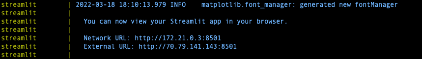

# Exploring Challenges in Human Data Annotation

### Prerequisites

Make sure you have [Docker](https://docs.docker.com/get-docker/) and [Docker Compose](https://docs.docker.com/compose/install/) installed and running before proceeding.

### Installation & Setup

1. Clone the git repository to your local machine:

    ```git clone https://github.com/nihaldsouza/yelp-annotation-study.git```

2. Change directory into the project folder:

    ```cd yelp-annotation-study```

3. Run the following command:

    ```docker-compose up```
  
>Note: This may take a few minutes as Elasticsearch requires some time to be setup. You can proceed once you see logs from the 'streamlit' container, something similar to:



4. On your browser visit:
[http://localhost:8501/](http://localhost:8501/)

5. To gracefully shutdown the app, Control + C
